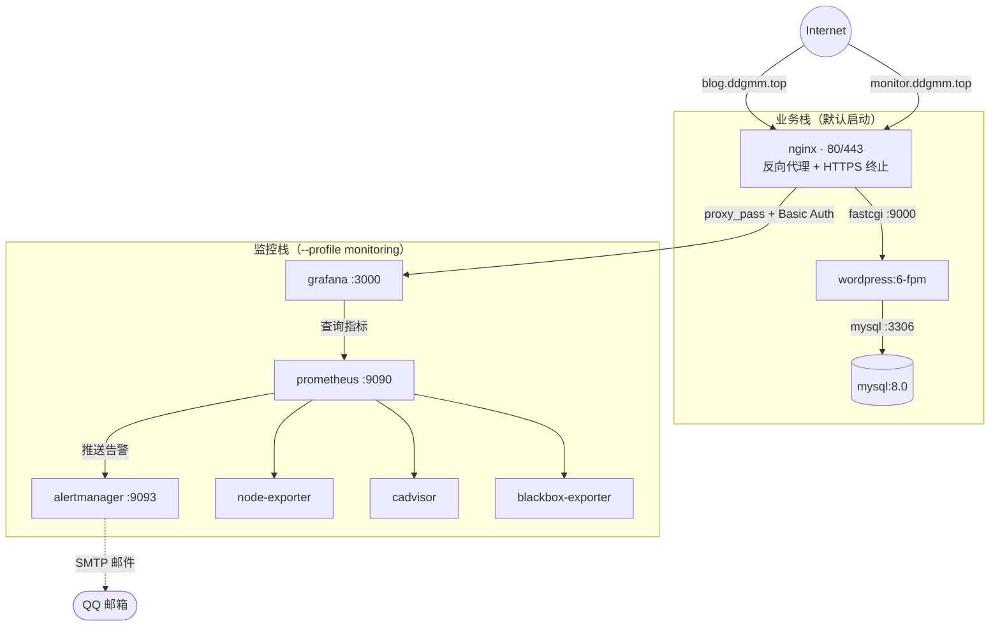
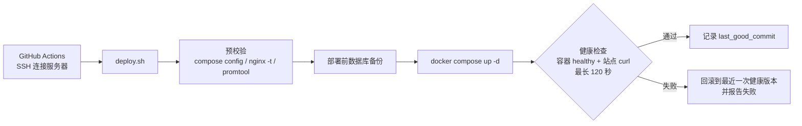

# ops-project · 云上运维实践：WordPress + 全栈监控 + 自动备份 + CI/CD

一个按生产标准搭建、并持续维护的运维实践项目：在单台云服务器（Ubuntu 24.04）上，用 **Docker Compose** 编排 WordPress 博客（Nginx + PHP-FPM + MySQL），配套完整的 **监控告警**、**备份恢复** 与 **CI/CD 自动部署回滚** 体系。

| 入口 | 地址 |
| ---- | ---- |
| 业务站点 | https://blog.ddgmm.top |
| 监控面板 | https://monitor.ddgmm.top（Nginx Basic Auth + Grafana 登录双重保护） |

**工程重点**

- **看得见故障**：主机 / 容器 / 站点三层监控；blackbox 拨测以“用户视角”验证站点可用性，覆盖“主机指标全绿、网站却打不开”的盲区
- **数据丢得起**：备份对“成功”有严格定义（完整性校验 + 结束标记）；失败、未执行、监控链路断开都会触发邮件告警；恢复流程经过真实验证
- **上线出不了事**：部署前预校验（compose / nginx / Prometheus），部署后健康检查，失败自动回滚到最近一次健康版本
- **攻击面够小**：仅 80/443 对外，管理组件全部只监听 127.0.0.1；敏感配置一律不入库

## 架构总览



**端口暴露原则**：宿主机只对外开放 `80/443`（Nginx）。Prometheus（9090）、Grafana（3000）、Alertmanager（9093）一律只监听 `127.0.0.1`，Grafana 通过 Nginx 反代对外；Prometheus / Alertmanager 无认证，需通过 SSH 隧道访问。

## 技术栈

| 用途 | 镜像 | 版本 |
| ---- | ---- | ---- |
| 服务器系统 | Ubuntu | 24.04 LTS |
| 容器引擎 | Docker CE + Compose v2 | — |
| Web 入口 / 反向代理 | `nginx:stable` | v1.30.5 |
| 应用（WordPress） | `wordpress:6-fpm` | PHP 8.3.31 |
| 数据库 | `mysql:8.0` | v8.0.46 |
| 主机指标 | `prom/node-exporter` | v1.10.2 |
| 容器指标 | `ghcr.io/google/cadvisor` | v0.60.5 |
| 站点拨测 | `prom/blackbox-exporter` | v0.26.0 |
| 指标存储 / 告警判断 | `prom/prometheus` | v3.5.0 |
| 告警分发 | `prom/alertmanager` | v0.28.0 |
| 可视化 | `grafana/grafana` | v12.3.1 |
| 证书 | certbot + Let's Encrypt | 90 天自动续期 |
| 备份 | bash + cron + 腾讯云 COS | 每日自动 |
| 流水线 | GitHub Actions | 自动部署 + 回滚 |

## 目录结构

```
ops-project/
├── docker-compose.yml            # 全部服务定义（监控栈用 profiles 控制，默认不启动）
├── php.ini                       # PHP 参数：上传 128M / 执行超时 300s（挂载进 wordpress 容器）
├── 项目大概.md                    # 架构草图和版本矩阵笔记
├── nginx/
│   └── conf.d/
│       ├── blog.conf             # 博客站点：80→443 跳转、HTTPS、PHP-FPM、安全头、上传目录禁 PHP
│       └── monitor.conf          # Grafana 反代 + Basic Auth（WebSocket 支持）
├── prometheus/
│   ├── prometheus.yml            # 抓取配置：自监控 / node / cadvisor / blackbox 拨测
│   └── rules/alerts.yml          # 告警规则：主机、采集、容器、业务、备份 5 组共 17 条
├── alertmanager/
│   └── alertmanager-example.yml  # 邮件告警配置模板（真实文件含授权码，不入库）
├── blackbox/
│   └── blackbox.yml              # 拨测模块：http_2xx / https_cert / icmp
├── scripts/
│   ├── backup_mysql.sh           # 数据库备份：校验 + 防并发 + 指标上报 + COS 上传
│   ├── backup_files.sh           # wp_data 数据卷备份（只读挂载打包）
│   ├── restore.sh                # 恢复：list / db / files（恢复前自动快照）
│   ├── deploy.sh                 # 预校验 → 部署 → 健康检查 → 失败自动回滚
│   └── reload-nginx.sh           # 证书续期后重载 Nginx（certbot deploy-hook）
├── .github/workflows/deploy.yml  # push main 自动触发服务器部署
├── backups/                      # 备份产物（运行时生成，已 gitignore）
└── logs/                         # backup.log / deploy.log / restore.log / nginx/（已 gitignore）
```

## 快速开始

### 前置条件

- Ubuntu 24.04 服务器，已安装 Docker CE 与 Compose v2，并完成基础加固（SSH 密钥登录、禁用 root、云防火墙仅放行 22/80/443）
- `blog.ddgmm.top`、`monitor.ddgmm.top` 解析到服务器
- 仓库克隆到 `/home/ddgmms/ops-project`（`deploy.sh` 使用的固定路径）

### 1. 目录与 `.env`（不入库）

```bash
cd /home/ddgmms/ops-project
mkdir -p certbot/www logs/nginx
```

```dotenv
MYSQL_DATABASE=wordpress
MYSQL_USER=wp_user
MYSQL_PASSWORD=<强密码>
MYSQL_ROOT_PASSWORD=<强密码>

DOMAIN=blog.ddgmm.top
MONITOR_DOMAIN=monitor.ddgmm.top
LETSENCRYPT_EMAIL=<证书到期提醒邮箱>

GRAFANA_ADMIN_PASSWORD=<强密码>
```

### 2. 两个敏感文件（不入库）

```bash
# Alertmanager 邮件配置：从示例复制，填入邮箱与 SMTP 授权码
cp alertmanager/alertmanager-example.yml alertmanager/alertmanager.yml

# monitor 站点访问密码：生成 apr1 哈希，拼成 htpasswd 格式
openssl passwd -apr1
# 按提示输入两次密码，把输出的哈希按 USER:HASH 拼进去
echo 'monitor:$apr1$xxxxxxxx$yyyy' > nginx/.htpasswd
chmod 644 nginx/.htpasswd   # 容器内 nginx worker 以非 root 运行，权限过紧会读不到并导致 500
```

### 3. 签发证书

```bash
sudo certbot certonly --webroot -w /home/ddgmms/ops-project/certbot/www \
     -d blog.ddgmm.top -d monitor.ddgmm.top
```

> Nginx 配置引用了证书文件，需在启动前完成签发。首次签发要求 80 端口能响应 ACME 校验——项目流程是先用仅 HTTP 的临时配置启动 Nginx，签发后再切换到仓库中的完整 HTTPS 配置。签发后的续期由 certbot 定时任务自动完成，并通过 deploy-hook 重载 Nginx（见第 5 步）。

### 4. 启动

```bash
docker compose up -d                        # 业务栈：db + wordpress + nginx
docker compose --profile monitoring up -d   # 业务栈 + 监控栈
```

### 5. 定时任务

```cron
# 每日备份：数据库 / 文件卷（错开执行，避免争抢资源；输出重定向到文件，cron 默认会丢弃输出）
30 2 * * * /bin/bash /home/ddgmms/ops-project/scripts/backup_mysql.sh >> /home/ddgmms/ops-project/logs/cron.log 2>&1
0  3 * * * /bin/bash /home/ddgmms/ops-project/scripts/backup_files.sh >> /home/ddgmms/ops-project/logs/cron.log 2>&1
```

```bash
# 证书续期成功后自动重载 Nginx，让新证书生效
sudo cp scripts/reload-nginx.sh /etc/letsencrypt/renewal-hooks/deploy/
sudo chmod +x /etc/letsencrypt/renewal-hooks/deploy/reload-nginx.sh
```

## 日常运维速查

```bash
cd /home/ddgmms/ops-project

# 可选：配置别名（监控栈命令较长，之后用 dcpm 代替 docker compose --profile monitoring）
echo "alias dc='docker compose --profile monitoring'" >> ~/.bashrc && source ~/.bashrc

# 查看容器状态
docker compose ps
docker compose --profile monitoring ps

# 看日志
docker compose logs -f nginx wordpress
docker compose --profile monitoring logs -f prometheus grafana

# 改完 Prometheus 配置后热加载（已开启 --web.enable-lifecycle）
curl -X POST http://127.0.0.1:9090/-/reload

# 改完 Nginx 配置后校验并重载
docker exec wp_nginx nginx -t && docker exec wp_nginx nginx -s reload

# 手动备份 / 查看可恢复的备份
./scripts/backup_mysql.sh
./scripts/restore.sh list
```

**监控入口**：Grafana 走 `https://monitor.ddgmm.top`；Prometheus / Alertmanager 无认证不对外，本机调试用 SSH 隧道：

```powershell
# 在本地执行
ssh -N -L 9090:127.0.0.1:9090 user@服务器IP
# 然后浏览器访问 http://127.0.0.1:9090
```

## 监控体系

### 采集层次

| 层次 | 组件 | 内容 |
| ---- | ---- | ---- |
| 主机 | node-exporter | CPU、内存、磁盘、负载、textfile 自定义指标（备份状态） |
| 容器 | cAdvisor | 每个容器的 CPU / 内存 / 重启次数 |
| 站点 | blackbox-exporter | 拨测 `https://blog.ddgmm.top` 与 `/wp-login.php`（可用性、响应时间、证书有效期） |
| 自监控 | Prometheus `up` 指标 | 所有抓取目标是否存活 |

Grafana 侧导入社区面板：Node Exporter Full（1860）、Docker 容器监控（193）与 Blackbox 拨测面板。

### 告警规则（prometheus/rules/alerts.yml）

- **主机**（host.rules）：CPU > 85%、内存 > 85%、磁盘 > 80%、磁盘 4 小时内写满预测、可用内存 < 10%、15 分钟负载过高
- **采集**（scrape.rules）：TargetDown（`up == 0`，抓取目标不可达）
- **容器**（container.rules）：业务容器数量不足、内存接近限额 85%、10 分钟内发生过重启
- **业务**（business.rules）：SiteDown、SiteSlow（> 5s）、证书 14 天内过期、证书已过期
- **备份**（backup.rules）：备份失败、超 26 小时未执行、备份指标缺失（监控链路断了）

### 告警分发（Alertmanager）

- 邮件通道（QQ SMTP 465），按 `alertname + instance` 分组，避免告警风暴刷屏
- `critical` 走快速通道：`group_wait: 10s`、`repeat_interval: 2h`；普通告警 30s / 4h
- 恢复时也发「已恢复」邮件（`send_resolved`）
- 抑制规则：磁盘「将写满」时抑制「使用率 80%」；站点「完全不可访问」时抑制「响应缓慢」

## 备份与恢复

### 备份设计

| 内容 | 脚本 | 关键点 |
| ---- | ---- | ------ |
| MySQL 数据库 | `backup_mysql.sh` | `mysqldump --single-transaction`；`set -o pipefail` 避免「管道最后一环 gzip 成功 → 误报备份成功」；校验 gzip 完整性、文件大小、`Dump completed` 结束标记 |
| wp_data 文件卷 | `backup_files.sh` | 临时 alpine 容器**只读**挂载卷打包；校验 tar 完整性、文件大小、包内含 `wp-content` |

两者共同特性：

- **防并发**：`flock` 锁，上次没跑完本次直接跳过
- **保留与异地**：本地保留 7 天；可选同步腾讯云 COS 异地副本（3-2-1 原则，安装 `coscmd` 后自动启用）
- **状态上报**：结果写入 `/var/lib/node_exporter/textfile/*.prom`，由 node-exporter 暴露为指标，失败可触发告警邮件
- **目标**：RPO ≈ 24 小时（每日全量）；RTO ≈ 10 分钟（脚本化恢复）

### 恢复

```bash
./scripts/restore.sh list                                   # 列出可用备份
./scripts/restore.sh db    backups/db_wordpress_xxx.sql.gz  # 恢复数据库
./scripts/restore.sh files backups/files_wp_data_xxx.tar.gz # 恢复文件卷
```

恢复流程内置保护：先校验备份文件完整性 → **自动对当前状态做一次快照**（后悔药）→ 停 WordPress → 恢复 → 起服务 → 站点可用性验证。

恢复能力经过真实验证：误删数据、`DROP DATABASE` 整库重建、文件卷（图片）丢失三类场景均完成完整恢复，并用数据量前后对比确认结果。

## CI/CD（GitHub Actions）

`push` 到 `main`（忽略 `**.md` / `docs/**` 等文档改动）或网页手动触发后：



- 健康检查失败会**自动回滚**到 `logs/last_good_commit`（记录最近一次健康成功的版本，避免在故障版本上原地打转）
- 预校验不通过时直接终止，**线上服务零影响**
- 部署过程加 `flock` 锁，同一时间只允许一个部署；CI 端 `concurrency` 同样限制

需要在仓库配置 5 个 Secrets：`SSH_HOST`、`SSH_USER`、`SSH_PORT`、`SSH_KEY`、`SSH_FINGERPRINT`。其中指纹用于校验服务器身份、防止中间人攻击，注意应使用 **ECDSA** 指纹（`appleboy/ssh-action` 对 ED25519 指纹存在已知的校验问题，会误报 mismatch）。

## 安全设计要点

按“纵深防御”分层设计：

- **网络边界**：云防火墙仅放行 `22/80/443`，系统侧 `ufw` 兜底。注意 Docker 的端口映射会绕过 `ufw`，所以管理端口的防护放在 Compose 层——Prometheus / Grafana / Alertmanager 一律只绑定 `127.0.0.1`
- **主机**：SSH 仅密钥登录、禁用 root 登录；`fail2ban` 自动封禁暴力破解来源；启用自动安全更新（仅安装安全补丁）
- **应用**：WordPress 登录接口限流（超限返回 429）、禁用 `xmlrpc.php`、上传目录禁止执行 PHP、关闭后台文件编辑（`DISALLOW_FILE_EDIT`）、收紧 `wp-config.php` 权限
- **监控面板**：Nginx Basic Auth + Grafana 登录双重保护；禁止注册、禁止匿名访问
- **容器**：非 root 运行；敏感目录只读挂载；`mem_limit` 限制内存；cAdvisor 使用 `privileged` 属明确取舍（不映射端口、`--docker_only` 缩小采集范围、profiles 控制启停）
- **日志与磁盘**：Docker 日志轮转（10m × 3）、Nginx 日志 logrotate、journald 容量上限——防止日志写满磁盘
- **凭据**：`.env`、`alertmanager/alertmanager.yml`、`nginx/.htpasswd` 一律不入库（见 `.gitignore`）；数据库密码经 `MYSQL_PWD` 传递，不出现在命令行与进程列表
- **部署链路**：CI 校验服务器指纹防中间人；部署脚本禁用 `git clean`，保护未跟踪的敏感文件
